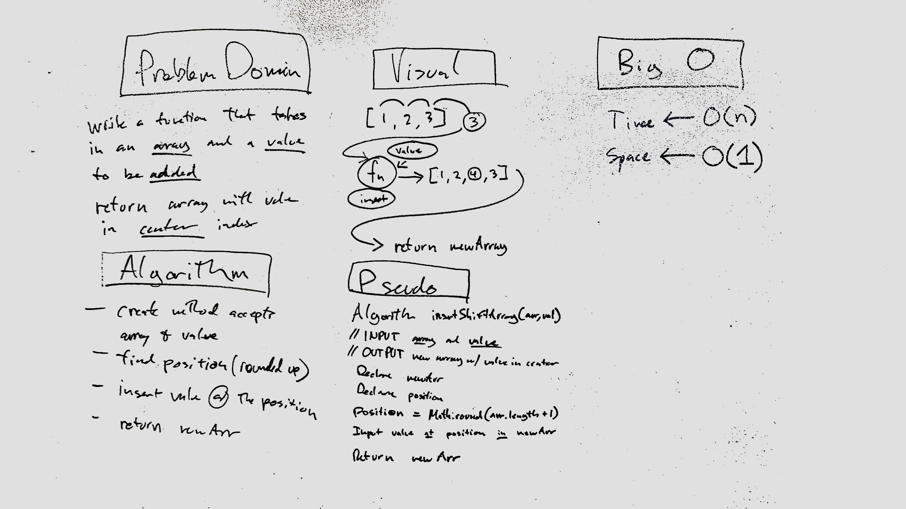

# CHALLENGE 01: Reverse an Array
<!-- Short summary or background information -->
reverse the elements of the given array

## Challenge
<!-- Description of the challenge -->
this is a function that takes in an array, creates a new empty array and pushes the orignal array reversed into it.

## Solution
<!-- Embedded whiteboard image -->

# CHALLENGE 02: Insert and shift middle index of array
<!-- Short summary or background information -->
make a function that takes in an array and a value, inserts the value into the middle of the array, and returns that array. the function first finds the middle of the array and defines a new array. with two parameters (array, val) the for loop checks the iteration i against the "middle" variable and when it matches it inserts the val there and returns the new array.

## Challenge
<!-- Description of the challenge -->
Write a function called insertShiftArray which takes in an array and the value to be added. Without utilizing any of the built-in methods available to your language, return an array with the new value added at the middle index.

## Solution
<!-- Embedded whiteboard image -->

# CHALLENGE 03: Binary Search
<!-- Short summary or background information -->

## Challenge
<!-- Description of the challenge -->

## Solution
<!-- Embedded whiteboard image -->

