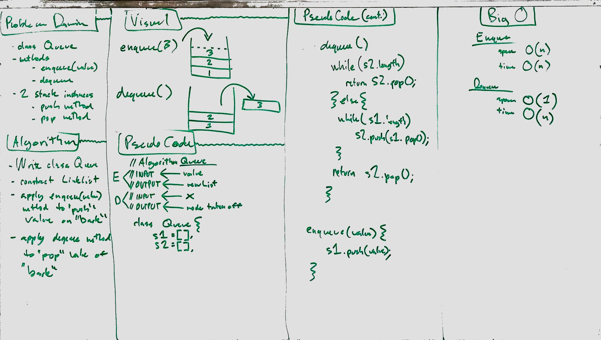
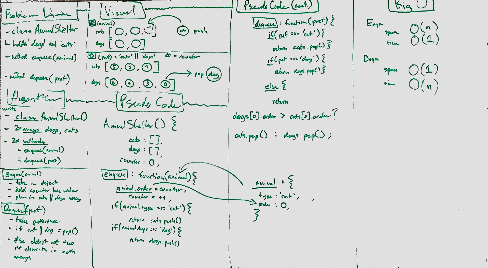
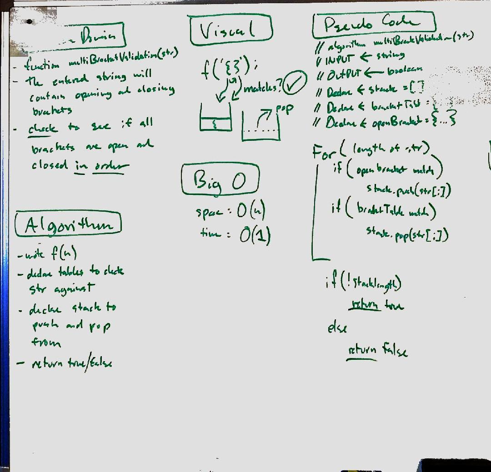
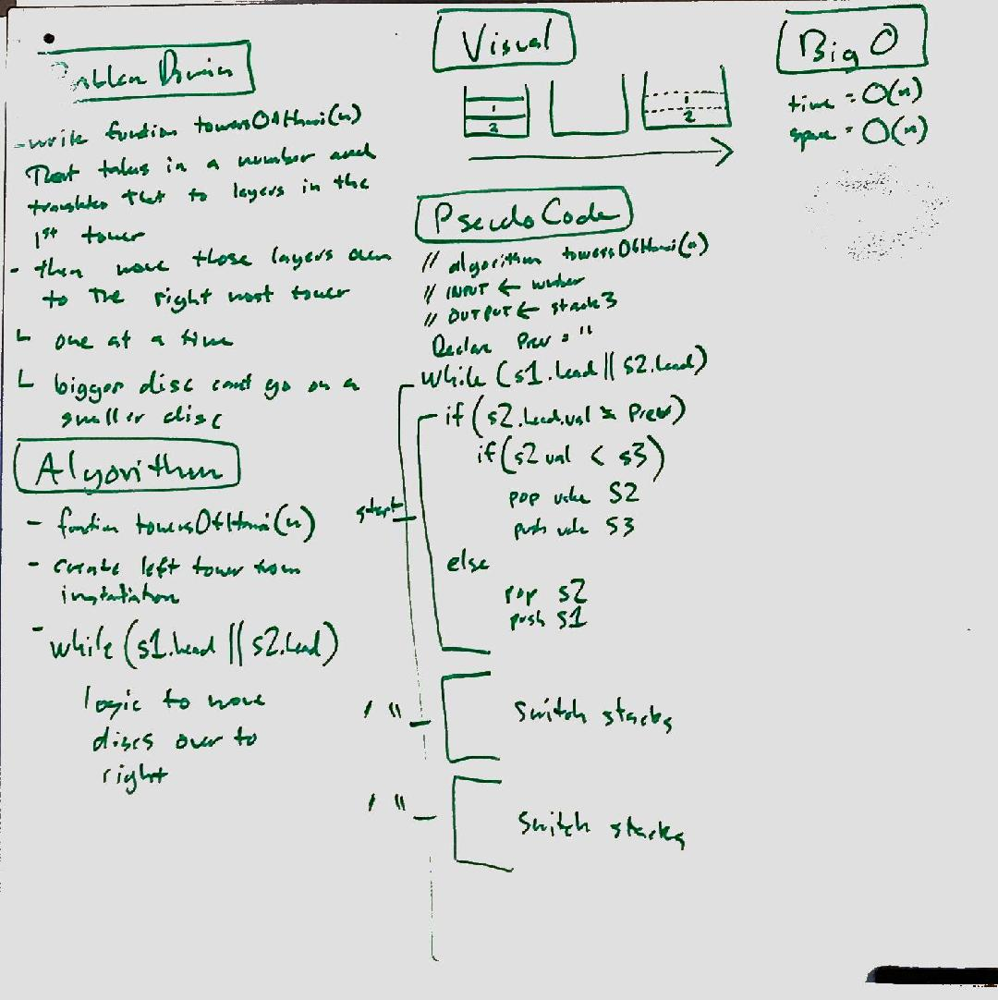
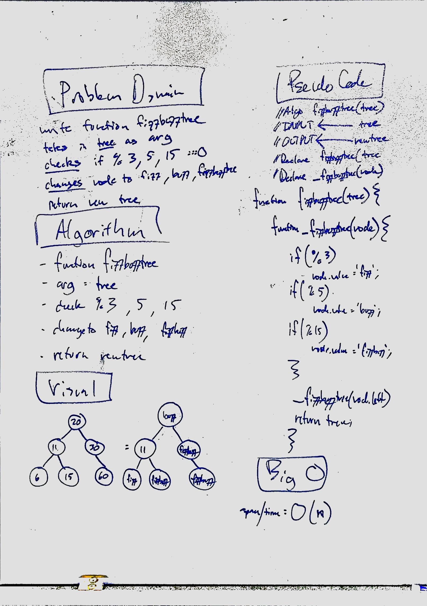
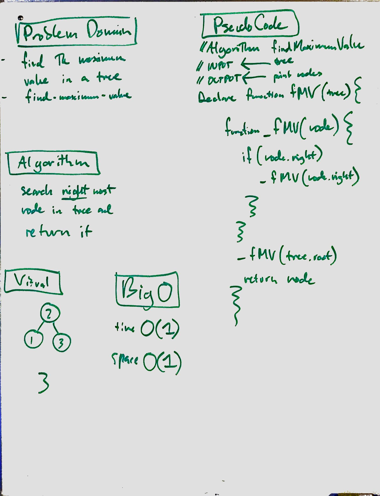

# CHALLENGE 01: Reverse an Array
<!-- Short summary or background information -->
reverse the elements of the given array

## Challenge
<!-- Description of the challenge -->
this is a function that takes in an array, creates a new empty array and pushes the orignal array reversed into it.

## Solution
<!-- Embedded whiteboard image -->

# CHALLENGE 02: Insert and shift middle index of array
<!-- Short summary or background information -->
make a function that takes in an array and a value, inserts the value into the middle of the array, and returns that array. the function first finds the middle of the array and defines a new array. with two parameters (array, val) the for loop checks the iteration i against the "middle" variable and when it matches it inserts the val there and returns the new array.

## Challenge
<!-- Description of the challenge -->
Write a function called insertShiftArray which takes in an array and the value to be added. Without utilizing any of the built-in methods available to your language, return an array with the new value added at the middle index.

## Solution
<!-- Embedded whiteboard image -->

# CHALLENGE 03: Binary Search
<!-- Short summary or background information -->
built the BinarySearch function to take in the desired inputs. we go through each element in a for loop checking to see if the element currently iterated on equals the second parameter value. if it does, pass the index of that value, if it never finds a match, return -1

## Challenge
<!-- Description of the challenge -->
Write a function called BinarySearch which takes in 2 parameters: a sorted array and the search key. Without utilizing any of the built-in methods available to your language, return the index of the array’s element that is equal to the search key, or -1 if the element does not exist.

## Solution
<!-- Embedded whiteboard image -->

# CHALLENGE 04: ADJACENT PRODUCT
<!-- Short summary or background information -->
build the LargestProduct function that takes in a 2D array and returns the largest product between neighboring values in the matrix (horizontally, vertically, diagonally)

## Challenge
<!-- Description of the challenge -->
Write a function called LargestProduct which takes in a 2D array, of arbitrary size.
Without utilizing any of the built-in methods available to your language, return the largest product of 2 adjacent values within the 2D array. 

## Solution
<!-- Embedded whiteboard image -->

# CHALLENGE 06: Linked List Insertion
<!-- Short summary or background information -->
need to create a link list constructor class along with methods to do the desired insertions actions

## Challenge
create a linked list class that has methods to append, insert before, and insert after nodes

## Solution
<!-- Embedded whiteboard image -->

# CHALLENGE 07: Linked List Kth From End
<!-- Short summary or background information -->
need to create a link list constructor class along with method to do the desired search action

## Challenge
<!-- Description of the challenge -->
create a linked list class that has a method to append nodes simply to have something to work with and a method used to search for specific nodes in the linke list and return the value

## Solution
<!-- Embedded whiteboard image -->

# CHALLENGE 08: Linked List Merge
<!-- Short summary or background information -->
write a funciton that takes in two linklists in aas arguments and combines them in a zipper pattern and then returns back that new linklist 

## Challenge
<!-- Description of the challenge -->
Write a function called mergeLists which takes two linked lists as arguments. Zip the two linked lists together into one so that the nodes alternate between the two lists and return a reference to the head of the single list. Try and keep additional space down to O(1). You have access to the Node class and all the properties on the Linked List class as well as the methods created in previous challenges.

## Solution
<!-- Embedded whiteboard image -->

# CHALLENGE 09: Linked List Detect Loop
<!-- Short summary or background information -->
write class method called hasLoop that takes no arguments and returns a boolean telling you if the LinkList your testing is circular or not

## Challenge
<!-- Description of the challenge -->
Write a method for the Linked List class called hasLoop which takes no arguments. Return a boolean that indicates whether or not a circular reference or loop is present in the linked list. Your implementation must not use any additional memory or modify the nodes of the linked list. You have access to the Node class and all the standard properties on the Linked List class as well as the methods created in previous challenges.        

## Solution
<!-- Embedded whiteboard image -->

# CHALLENGE 11: Stacks and Queues: Queue with Stacks
<!-- Short summary or background information -->
create a class called Queue and make methods for enqueue and dequeue

## Challenge
<!-- Description of the challenge -->
you have access to two stacks
the method enqueue should take in a value and essetially "shift()" the value onto the stack
the method dequeue should take off and return the last value in the stack
       
## Solution
<!-- Embedded whiteboard image -->

# CHALLENGE 12: Stacks and Queues: Fifo Animal Shelter
<!-- Short summary or background information -->
make an animla shelter that takes in only dogs and cats and when someone wants either a dog or a cat they are given the longest waiting one

## Challenge
<!-- Description of the challenge --> 
create class called AnimalShelter which hold only dogs or cats in a stack (FIFO)
the method enqueue(animal) should add a dog or a cat to the shelter
the method dequeue(pref) should take off the longest waiting dog or cat

## Solution
<!-- Embedded whiteboard image -->

# CHALLENGE 13: Stacks and Queues: Multibracket Validation
<!-- Short summary or background information -->
Your function should take a string as its only argument, and should return a boolean representing whether or not the brackets in the string are balanced. There are 3 types of brackets: {} [] ()
## Challenge
<!-- Short summary or background information -->
make function called multiBracketValidation(string)
the function should check if the bracket is balanced or not

## Solution
<!-- Embedded whiteboard image -->

# CHALLENGE 14: Stacks and Queues: Towers of Hanoi
<!-- Short summary or background information -->
the idea is to move a tower of discs from the left over to the right

## Challenge
<!-- Description of the challenge -->
make function called towersOfHanoi(n)
move entire tower (which starts at the left) to the right
one disc at a time
cant put a larger disc on a smaller disc

## Solution
<!-- Embedded whiteboard image -->

# CHALLENGE 16: Binary Trees: Fizz Buzz Tree
<!-- Short summary or background information -->
the idea is to return a modified tree per the challenge instructions below

## Challenge
<!-- Description of the challenge -->
Without utilizing any of the built-in methods available to your language, determine weather or not the value of each node is divisible by 3, 5 or both, and change the value of each of the nodes respectively. Return the tree with it’s news values.

## Solution
<!-- Embedded whiteboard image -->

# CHALLENGE 17: Binary Trees: Breadth First Search
<!-- Short summary or background information -->
print all the trees values in the order of the resulting breadth first search

## Challenge
<!-- Description of the challenge -->
Write a function called breadthFirstTraversal which takes a Binary Tree as its unique input. Without utilizing any of the built-in methods available to your language, traverse the input tree using a Breadth-first approach; print every visited node’s value.

## Solution
<!-- Embedded whiteboard image -->

# CHALLENGE 18: Binary Trees: Find Maximum Value
<!-- Short summary or background information -->
the idea is to the node with the largest value in tree

## Challenge
<!-- Description of the challenge -->
Write a function called find-maximum-value which takes binary tree as its only imput. Without utilizing any of the built-in methods available to your language, return the maximum value stored in the tree. You can assume that the values stored in the Binary Tree will be numeric.

## Solution
<!-- Embedded whiteboard image -->
